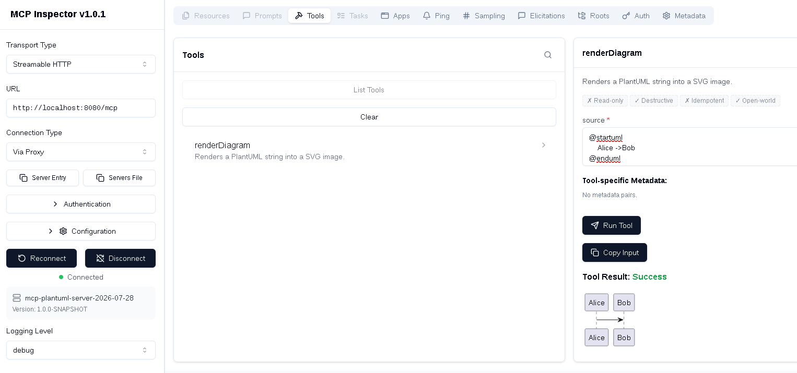

# Stateless MCP Plantuml Server (MCP protovol version 2026-07-28)

The MCP server renders diagram in SVG format using the MCP protocol version 2026-07-28.
This is stateless MCP protocol, no need to initialize session compared to earlier versions.

Also this MCP server supports earlier versions over sse and streamable http.

This project uses Quarkus, the Supersonic Subatomic Java Framework.

## Running the application in dev mode

You can run your application in dev mode that enables live coding using:

```shell script
./gradlew quarkusDev
```

Server listens on `http://localhost:8080/mcp`


## Curl test 

```
curl -s -X POST \
  -H "Content-Type: application/json" \
  -H "Accept: application/json, text/event-stream" \
  -d '{
    "jsonrpc": "2.0",
    "id": 2,
    "method": "tools/call",
    "params": {
      "name": "renderDiagram",
      "arguments": {
        "source": "@startuml\nUser -> AI: Quarkus mcp server works\n@enduml"
      }
    }
  }' "http://localhost:8080/mcp"
```

The expected output, the data is shortened.

```
{"jsonrpc":"2.0","id":2,"result":{"isError":false,"content":[{"data":"PD9...Zz4=","mimeType":"image/svg+xml","type":"image"}]}}

```


## MCP Inspector test

The mcp inspector v2 currently is not able to connect to streaming http.
The ticket exists  https://github.com/modelcontextprotocol/inspector/issues/1858

The mcp inspector v1 sample run

